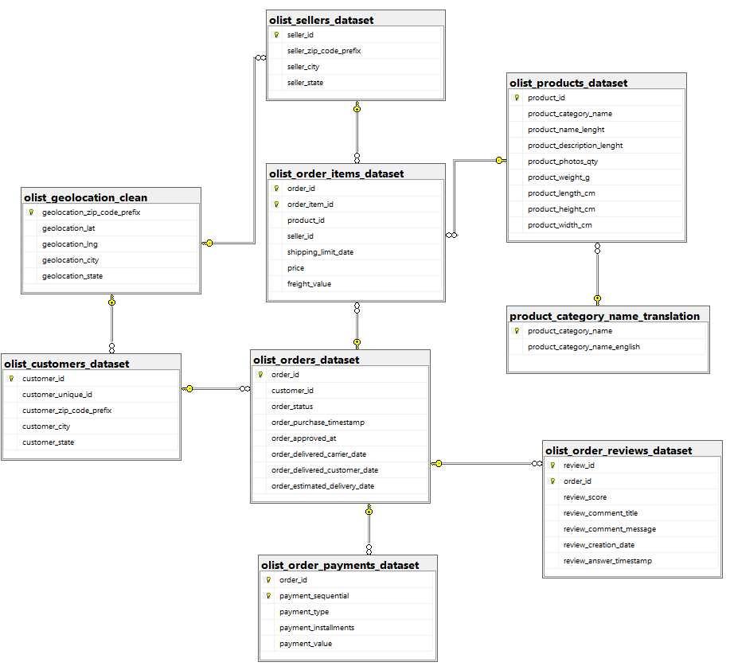
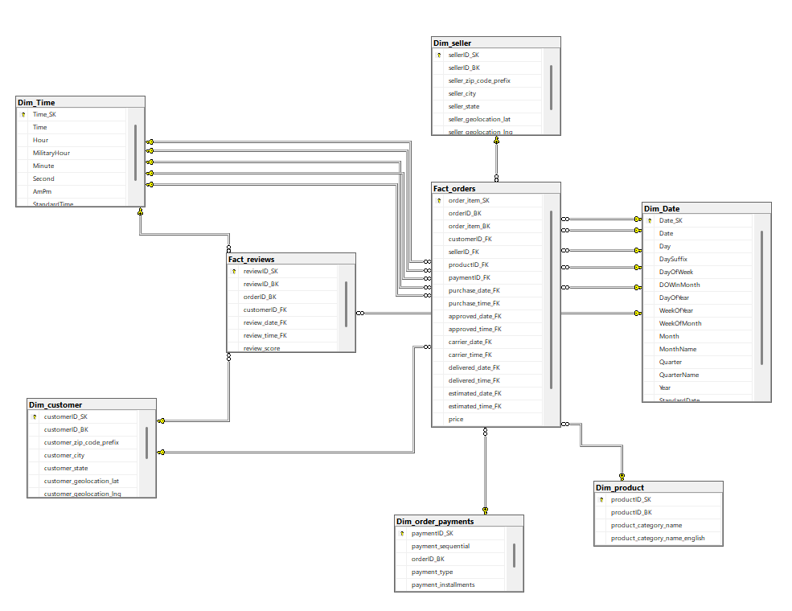
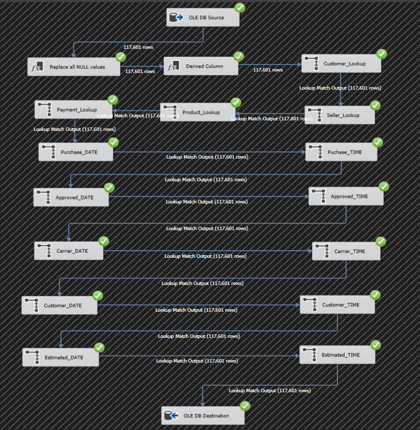
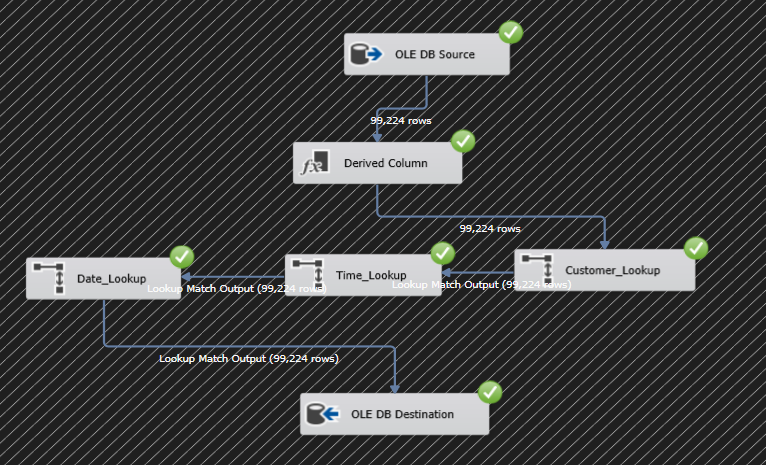
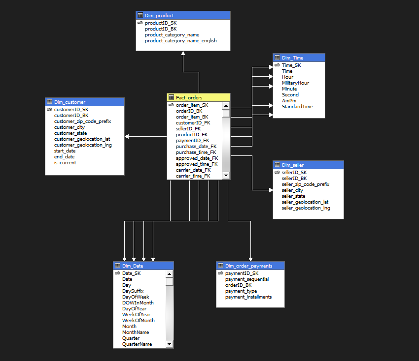
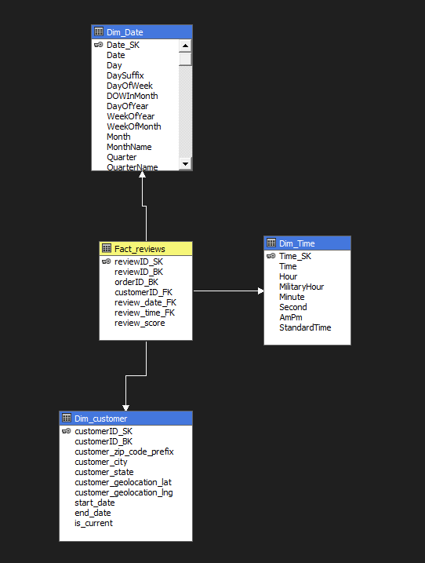

# 🛒 Olist E-Commerce — End-to-End Data Engineering Project

> A complete Business Intelligence pipeline built on the Brazilian Olist e-commerce dataset — from raw relational data to a fully modeled data warehouse, automated ETL, OLAP cubes, and interactive Power BI dashboards.

---

## 📌 Project Overview

This project covers the **full data engineering lifecycle**:

1. **Source Database** — Explored and modeled raw CSV data from Kaggle into a normalized relational schema in SQL Server
2. **Data Warehouse** — Designed and built a Star Schema DW with Fact and Dimension tables
3. **ETL (SSIS)** — Automated data loading pipelines with SCD Type 2, Incremental Load, and Lookup transformations
4. **OLAP (SSAS)** — Built multidimensional Analysis Services cubes for `Fact_orders` and `Fact_reviews`
5. **Reporting (Power BI)** — Created 5 analytical dashboard pages with slicers, KPIs, and charts

---

## 🗂️ Dataset

- **Source:** [Brazilian E-Commerce Public Dataset by Olist](https://www.kaggle.com/datasets/olistbr/brazilian-ecommerce) (Kaggle)
- **Tables:** 9 raw CSV files covering orders, customers, sellers, products, payments, reviews, and geolocation
- **Size:** ~100K orders | ~99K customers | ~3K sellers

---

## 🏗️ Architecture

```
Kaggle CSV Files
      │
      ▼
┌─────────────────────────┐
│   SQL Server Database    │   ← Cleaned & Normalized (8 tables + PKs + FKs)
└────────────┬────────────┘
             │  SSIS ETL
             ▼
┌─────────────────────────┐
│     Data Warehouse       │   ← Star Schema (2 Facts + 6 Dimensions)
│  (SQL Server DW)         │
└────────────┬────────────┘
             │  SSAS
             ▼
┌─────────────────────────┐
│     OLAP Cubes           │   ← Fact_orders cube + Fact_reviews cube
└────────────┬────────────┘
             │  Power BI
             ▼
┌─────────────────────────┐
│   5 Dashboard Pages      │   ← Sales / Customers / Delivery / Sellers / Reviews
└─────────────────────────┘
```

---

## 🗄️ Phase 1 — Source Database Design

### Data Exploration & Cleaning

| Table | Issue Found | Resolution |
|---|---|---|
| `olist_customers_dataset` | Duplicate identifier columns (`customer_id` vs `customer_unique_id`) | Kept `customer_id` (used as FK in other tables) |
| `olist_geolocation_dataset` | Duplicate zip codes (multiple GPS points per zip) | Aggregated using `AVG(lat)`, `AVG(lng)`, `MAX(city/state)` into `olist_geolocation_clean` |
| `olist_orders_dataset` | Nulls in `order_approved_at`, `order_delivered_*` | Handled via SSIS derived column logic (see ETL phase) |
| `olist_order_reviews_dataset` | Nulls in title and message columns | Replaced with `'no_title'` / `'no_message'` |
| `olist_products_dataset` | Nulls in category and dimension columns | Replaced category with `'unknown'`, numeric columns with `0` |

### Constraints Applied

- **Primary Keys** defined on all 8 tables (including composite PKs on `order_items`, `order_payments`, `order_reviews`)
- **Foreign Keys** established across all relationships
- Missing zip codes for sellers/customers inserted into geolocation table as `'unknown'` records before FK constraints were applied
- Missing product categories inserted into translation table before FK constraint

**Schema Diagram:**



---

## 🏭 Phase 2 — Data Warehouse Design

### Star Schema

The DW follows a **Star Schema** with:

**Fact Tables:**
- `Fact_orders` — grain: one row per order item
- `Fact_reviews` — grain: one row per customer review

**Dimension Tables:**

| Dimension | Key | Description |
|---|---|---|
| `Dim_customer` | customerID_SK | Customer details + geolocation (SCD Type 2) |
| `Dim_seller` | sellerID_SK | Seller details + geolocation |
| `Dim_product` | productID_SK | Product category (Portuguese + English) |
| `Dim_order_payments` | paymentID_SK | Payment type, installments |
| `Dim_Date` | Date_SK (YYYYMMDD) | Full date breakdown — day, week, month, quarter, year, holidays |
| `Dim_Time` | Time_SK | Every second of the day — hour, minute, second, AM/PM |

**Design Decisions:**
- `Dim_Date` populated for range 2015–2025 with US holiday flags
- `Dim_Time` populated at second-level granularity (86,400 rows)
- A sentinel row (`Date_SK = -1`, `1900-01-01`) was inserted to handle NULL date lookups gracefully
- `Fact_orders` tracks **5 date/time pairs**: purchase → approved → carrier → delivered → estimated

**Warehouse Schema Diagram:**



---

## ⚙️ Phase 3 — ETL with SSIS

### Dim_customer — SCD Type 2

Implemented using the **Slowly Changing Dimension** component:

- **Changing Attribute Updates** → triggers `OLE DB Command` to set `is_current = 0` and populate `end_date` on old record
- **Historical Attribute Inserts** → routes to `Derived Column` (sets `start_date`, `end_date`, `is_current`)
- **New Output** → new customers inserted directly
- Final `Union All` merges all branches → `Derived Column 1` → `Insert Destination`

> 99,441 rows processed

.png))

---

### Fact_orders — Full Load

The Fact_orders ETL pipeline involves:

1. **OLE DB Source** — joins orders, order items, customers
2. **Replace NULL values** — fills missing dates using business rules
3. **Derived Column** — transforms timestamps into separate date/time parts
4. **Lookup transformations** (chained, 117,601 rows each):
   - `Customer_Lookup` → `customerID_SK`
   - `Seller_Lookup` → `sellerID_SK`
   - `Product_Lookup` → `productID_SK`
   - `Payment_Lookup` → `paymentID_SK`
   - `Purchase_DATE` + `Purchase_TIME`
   - `Approved_DATE` + `Approved_TIME`
   - `Carrier_DATE` + `Carrier_TIME`
   - `Customer_DATE` + `Customer_TIME`
   - `Estimated_DATE` + `Estimated_TIME`
5. **OLE DB Destination** — inserts into `Fact_orders`

> 117,601 rows loaded



---

### Fact_orders — Incremental Load

To support future data updates without full reloads:

1. `select_max` — retrieves the current max `purchase_date` from the warehouse
2. **Data Flow Task** — loads only rows where `purchase_timestamp > max_date`
3. `Get_max_date_after_entering_new_data` — retrieves new max after load
4. `Update_max_date` — updates the watermark table

.png)

---

### Fact_reviews — Full Load

Simpler pipeline: OLE DB Source → Derived Column → parallel Lookups (Date, Time, Customer) → OLE DB Destination

> 99,224 rows loaded



---

## 🧊 Phase 4 — OLAP with SSAS

Built two Analysis Services multidimensional cubes:

**Fact_orders Cube** — connected dimensions: Dim_customer, Dim_seller, Dim_product, Dim_order_payments, Dim_Date (×5 roles), Dim_Time (×5 roles)



**Fact_reviews Cube** — connected dimensions: Dim_customer, Dim_Date, Dim_Time



---

## 📊 Phase 5 — Power BI Dashboards

5 report pages, all with Year and Month slicers:

---

### 1. Sales Overview

**KPIs:** Total Orders (118K) | Total Revenue (14.21M) | Total Customers (99K) | Avg Review Score (4.09)

- Line chart: Total Revenue by Month
- Bar chart: Top 10 Product Categories by Revenue (health_beauty leads at 1.30M)

.png)

---

### 2. Customer Analysis

**KPIs:** Total Orders (118K) | Total Customers (99K) | Orders per Customer (1.19)

- Bar chart: Top 10 Cities by Orders (São Paulo: 18.6K)
- Bar chart: Top 10 States by Orders (SP: 50K)

.png)

---

### 3. Delivery Performance

**KPIs:** Avg Delivery Days (12.42) | Late Deliveries (7,527) | Total Orders (118K)

- Line chart: Avg Delivery Days by Month (fastest in August: ~8.5 days)
- Donut chart: Orders by Status (delivered: 97.82%)

.png)

---

### 4. Seller Performance

**KPIs:** Total Sellers (3,095) | Total Revenue (14.21M)

- Bar chart: Top 10 Sellers by Revenue
- Bar chart: Top 10 Seller Cities by Revenue (São Paulo: 2.8M)

.png)

---

### 5. Reviews & Satisfaction

**KPIs:** Avg Review Score (4.09) | Total Orders (118K)

- Bar chart: Order Distribution by Score (score 5 dominates: 57K)
- Bar chart: Avg Review Score by Month (consistent ~4.0 across all months)

.png)

---

## 🛠️ Tech Stack

| Layer | Tool |
|---|---|
| Database | Microsoft SQL Server |
| ETL | SQL Server Integration Services (SSIS) |
| OLAP | SQL Server Analysis Services (SSAS) |
| Reporting | Power BI Desktop |
| Data Source | Kaggle (Brazilian E-Commerce by Olist) |

---

## 📁 Repository Structure

```
olist-data-engineering/
│
├── sql/
│   ├── Batabase_Schema_Creation.sql       # Source DB: PKs, FKs, geolocation cleanup
│   └── Data_Warehouse_Schema_Creation.sql # DW: all tables, Dim_Date, Dim_Time population
│
├── screenshots/
│   ├── Database_Schema.png
│   ├── Data_Warehouse_Schema.png
│   ├── DIm_customer_SCD_.png
│   ├── Fact_orders.png
│   ├── Fact_orders__Incremental_Load_.png
│   ├── Fact_reviews.png
│   ├── Fact_orders_SSAS.png
│   ├── Fact_reviews_SSAS.png
│   ├── Sales_Overview__Power_BI_.png
│   ├── Customer_Analysis__Power_BI_.png
│   ├── Delivery_Preformance__Power_BI_.png
│   ├── Seller_Preformance__Power_BI_.png
│   └── Reviews___Satisfication___Power_BI_.png
│
└── README.md
```

---

## 🔑 Key Technical Highlights

- **Composite Primary Keys** on `order_items` (order_id + item_id), `order_payments` (order_id + payment_sequential), and `order_reviews` (order_id + review_id)
- **Geolocation deduplication** — aggregated ~1M GPS points to unique zip codes before applying FK constraints
- **SCD Type 2** on `Dim_customer` — full history tracking with `start_date`, `end_date`, `is_current`
- **Incremental Load** on `Fact_orders` using a watermark table to avoid full reloads
- **5 date role-playing dimensions** in `Fact_orders` (purchase, approved, carrier, delivered, estimated)
- **Second-level time dimension** (86,400 rows) enabling precise timestamp analysis
- **Sentinel rows** (`-1` / `1900-01-01`) for graceful NULL handling in date/time lookups
- **Two SSAS cubes** with multi-role dimension relationships

---

## 📈 Business Insights (from Power BI)

- São Paulo dominates both customers (18.6K orders) and sellers (2.8M revenue)
- `health_beauty` is the top revenue category at **1.30M BRL**
- Average delivery takes **12.42 days** — fastest in August (8.5 days), slowest in January/February (~15 days)
- **97.82%** of orders are successfully delivered
- Customer satisfaction is consistently high: **Avg score 4.09/5** stable across all months
- Most customers place only **1.19 orders** on average — low repeat purchase rate

---
